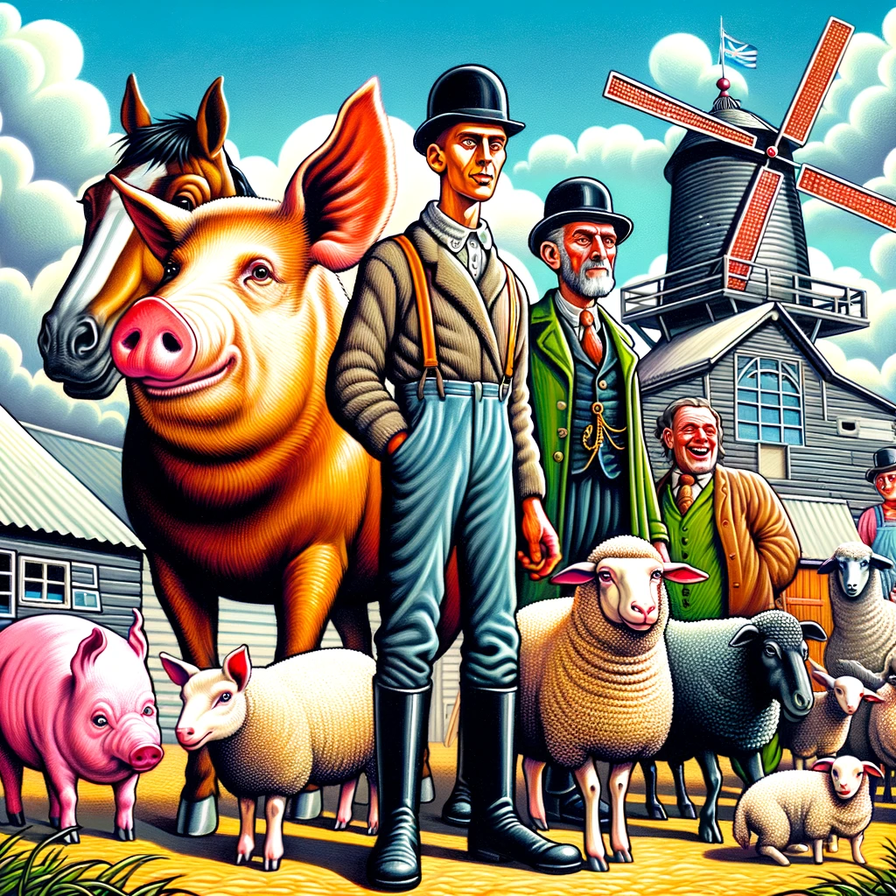

# Introduction to 'Animal Farm'
Overview of George Orwell's classic allegory of the Russian Revolution and the Soviet Union's early years.

---

# Main Characters
- **Napoleon**: Allegory for Joseph Stalin, embodies the corruption of power.
- **Snowball**: Represents Leon Trotsky, a rival to Stalin.
- **Boxer**: Symbolizes the working class, loyal and strong.
- **Squealer**: Propagandist pig, parallels figures who spread Stalin's propaganda.
- **Old Major**: Represents Karl Marx and Vladimir Lenin, the revolution's ideological founders.

---

# Key Themes
- **Power and Corruption**: How power corrupts and absolute power corrupts absolutely.
- **The Russian Revolution Allegory**: The characters and events as symbols of the Russian Revolution.
- **The Role of Propaganda**: How information is used to control the populace.

---

# Plot Summary
A chronological overview of the key events in the book.

---

# Symbolism in 'Animal Farm'
- **The Farm**: Represents Russia and the Soviet Union.
- **The Windmill**: Symbol of industrial progress and manipulation.
- **The Song 'Beasts of England'**: Represents revolutionary hope and change.

---

# Critical Reception and Impact
- **Initial Reception**: Controversial and politically charged.
- **Impact on Literature and Political Thought**: Enduring influence and relevance.

---

# Conclusion
Summary of key points and the enduring relevance of 'Animal Farm' in modern times.
